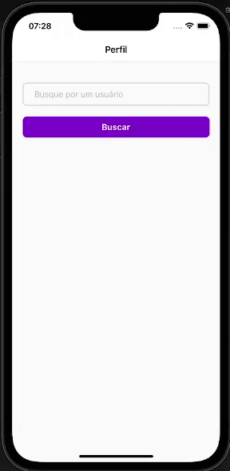

## What is AluraHub?

Alurahub is an application made with React Native that allows one to save a profile with informations, such as the person name and photo, and  enable queries in a repository that contains data.

how does it work? The app consumes a local fake API with json-server.

This project is used in the fourth Alura React Native course.


<h1 align="center">
    
</h1>


## Technologies

This project was developed using these technologies:
- [React Native][rn]
- [Expo][expo]

## How to use

To copy this application, you need three requirements: [Git](https://git-scm.com), [Node.js][nodejs] + [Yarn][yarn] installed in your machine.

In the shell, type the following commands:

### Download and install the project

```bash
# Clone this repository
$ git clone https://github.com/alura-cursos/react-native-ficando-online.git

# Access the repository
$ cd AluraHub

# Install project dependencies
$ npm install
```

### Running

```bash
# Run it in a different shell (inside Alurahub project folder)
$ expo start
```

[nodejs]: https://nodejs.org/
[expo]: https://docs.expo.dev/
[rn]: https://facebook.github.io/react-native/
[yarn]: https://yarnpkg.com/
